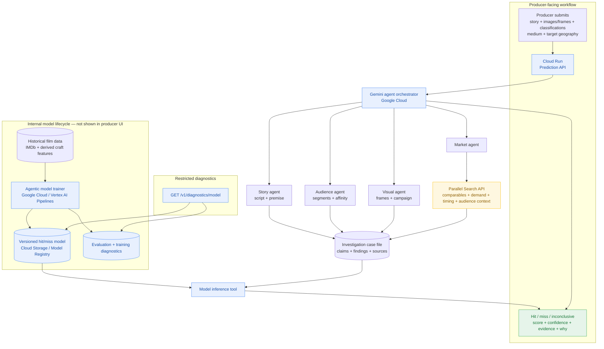

# Proposed Lumen architecture

## Existing backend fit

`agentic-cinema-hack` already provides the ingestion, Gemini visual inspection, Parallel Search client, agentic trainer, quant agent, and quant oracle pieces. The remaining backend boundary is the outcome adapter: its current oracle returns expected IMDb rating and craft residuals, while Lumen’s API must return a calibrated `hit`, `miss`, or `inconclusive` outcome.

## What the current UI implements

The deployed UI is a realistic interaction mock, not a live inference client yet. It currently implements:

1. Producer inputs: story/concept text, medium, target geography, and multiple creative-material uploads.
2. A four-agent progress experience: Story, Audience, Market, and Visual.
3. A result view with score, confidence, agent findings, “why it could win,” and watchouts.
4. Architecture and team explanation pages.

The run is simulated in the browser today. The displayed result is fixture data so the product flow can be reviewed before the backend exists.

## What happens next

1. Backend developer implements `POST /v1/predictions` from `openapi/lumen-api.yaml`.
2. Backend stores uploads in a project-scoped bucket and returns signed or scoped material URIs.
3. Gemini orchestrates the four agents; the Market agent calls Parallel Search.
4. Backend invokes the versioned model through the inference tool and adds the calibrated hit/miss outcome adapter.
5. Frontend replaces the browser timer and fixture result with the real request, progress events, and response.
6. Backend exposes `GET /v1/diagnostics/model` behind restricted authentication for trainer/model health.

Bruno can exercise steps 1 and 6 immediately against a local mock server using the collection in `bruno/lumen-api`.
