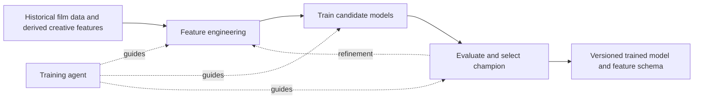
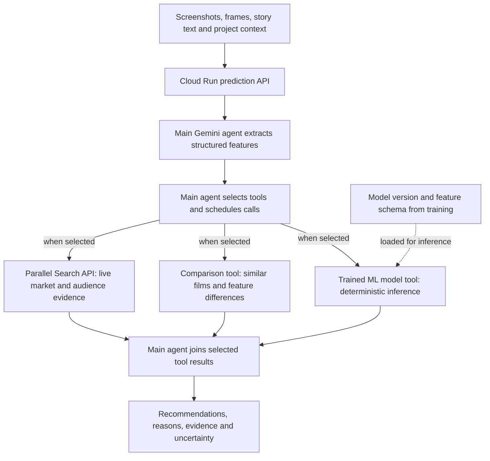

# Lumen architecture

Lumen separates agentic ML training from runtime recommendations. Training produces a fixed model; the main runtime agent uses that model as a deterministic tool and decides which independent tool calls to execute concurrently.

## 1. Agentic ML training

The model is trained once today through an agent-guided pipeline. The training agent guides feature engineering, candidate training, evaluation and champion selection. Automated repeat training runs are a future capability, not a continuous process currently in operation.

The pipeline records evaluation metrics alongside the selected model version. Its model and feature schema become the runtime inference tool. Training is separate from user prediction requests.

## 2. Runtime recommendations

The main Gemini agent receives screenshots, frames, story text and project context through the Cloud Run prediction API. It extracts structured features, validates model inputs, and plans the tool calls needed for the request.

The branches represent tools available to the main agent, not a mandatory fixed set of calls. The LLM chooses which tools to call and which calls can run in parallel. Independent model, comparison and research calls may run concurrently once their inputs are ready; dependent calls wait for their prerequisites. The agent combines their results to form a recommendation.

“Parallel Search” is the named research service. “Parallel calls” means concurrent execution chosen by the agent; these are separate concepts.

The ML tool is deterministic for a fixed model version and validated feature input. Feature extraction, orchestration and recommendation synthesis are agentic, so the complete workflow is not described as deterministic. The model is not retrained during a recommendation request.

### Backend mapping and output contract

The existing backend components described in this project map to these two sections: `agentic_trainer.py` and `quant_agent.py` handle training and champion selection; ingestion and visual inspection derive features; `oracle.py` provides model inference; and `parallel_search_client.py` retrieves research evidence. This diagram describes the agreed architecture, not verification that every backend connection is deployed.

The existing oracle is described as returning expected IMDb rating and craft residuals. A commercial `hit`, `miss`, or `inconclusive` outcome still requires a defined success target and a calibrated outcome adapter. Expected rating must not be presented as commercial hit probability without that mapping.

The frontend has mock and API execution modes. See `API_CONTRACT.md` and `DEPLOYMENT_ENVIRONMENTS.md` for the integration and deployment details. Model diagnostics remain internal to the training/model lifecycle.
